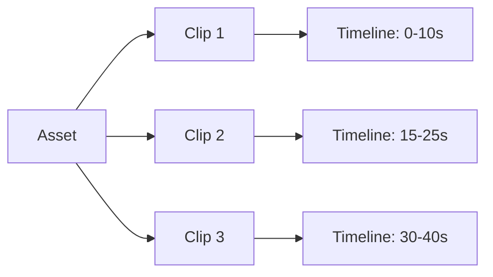

# Assets e Clips

**Assets** são os recursos (vídeos, áudios, imagens, textos) que você quer usar, enquanto **Clips** definem **como** e **quando** esses assets aparecem na timeline.

## Conceitos Fundamentais



<Info>
  **Analogia**: O asset é como um arquivo na sua biblioteca, e o clip é como usar esse arquivo em um momento específico do seu vídeo.
</Info>

## Assets

### Tipos de Assets

<Tabs>
  <Tab title="🎬 Vídeo">
    ```json
    {
      "asset": {
        "type": "video",
        "source": "url",
        "src": "https://exemplo.com/video.mp4",
        "volume": 0.8,
        "trim": {
          "start": 5,
          "end": 15
        }
      }
    }
    ```
    
    **Propriedades:**
    - `volume`: 0.0 a 1.0 (padrão: 1.0)
    - `trim`: Cortar partes específicas do vídeo
    - `mute`: true/false para silenciar
  </Tab>
  
  <Tab title="🎵 Áudio">
    ```json
    {
      "asset": {
        "type": "audio",
        "source": "url", 
        "src": "https://exemplo.com/musica.mp3",
        "volume": 0.5,
        "isBackground": true,
        "fadeIn": 2,
        "fadeOut": 3
      }
    }
    ```
    
    **Propriedades:**
    - `isBackground`: Define se é música de fundo
    - `fadeIn/fadeOut`: Duração do fade em segundos
    - `loop`: true/false para repetir
  </Tab>
  
  <Tab title="🖼️ Imagem">
    ```json
    {
      "asset": {
        "type": "image",
        "source": "url",
        "src": "https://exemplo.com/imagem.jpg",
        "fit": "cover",
        "position": "center"
      }
    }
    ```
    
    **Propriedades:**
    - `fit`: "cover", "contain", "fill", "stretch"
    - `position`: "center", "top", "bottom", "left", "right"
    - `opacity`: 0.0 a 1.0
  </Tab>
  
  <Tab title="📝 Texto">
    ```json
    {
      "asset": {
        "type": "text",
        "text": "Meu texto aqui",
        "style": {
          "fontSize": 48,
          "fontColor": "white",
          "fontFamily": "Arial",
          "bold": true,
          "italic": false,
          "alignment": "center",
          "backgroundColor": "rgba(0,0,0,0.5)",
          "padding": 20
        }
      }
    }
    ```
    
    **Propriedades de Estilo:**
    - `fontSize`: Tamanho em pixels
    - `fontColor`: Cor em hex, rgb ou nome
    - `alignment`: "left", "center", "right"
    - `backgroundColor`: Fundo do texto
  </Tab>
</Tabs>

### Fontes de Assets

<CardGroup cols={3}>
  <Card title="🌐 URL" icon="link">
    ```json
    {
      "source": "url",
      "src": "https://exemplo.com/video.mp4"
    }
    ```
    Carrega de uma URL pública
  </Card>
  
  <Card title="📁 Upload" icon="upload">
    ```json
    {
      "source": "upload",
      "src": "base64_encoded_data"
    }
    ```
    Upload direto via base64
  </Card>
  
  <Card title="💾 Local" icon="hard-drive">
    ```json
    {
      "source": "local",
      "src": "/storage/assets/video.mp4"
    }
    ```
    Arquivo já no servidor
  </Card>
</CardGroup>

## Clips

### Estrutura do Clip

```json
{
  "asset": { /* definição do asset */ },
  "start": 0,        // Quando inicia na timeline
  "length": 10,      // Duração do clip
  "effects": [],     // Efeitos aplicados
  "transform": {}    // Transformações visuais
}
```

### Propriedades Temporais

<AccordionGroup>
  <Accordion title="Start Time" icon="clock">
    Define quando o clip aparece na timeline:
    
    ```json
    {
      "start": 5.5,  // Inicia aos 5.5 segundos
      "length": 10   // Termina aos 15.5 segundos
    }
    ```
    
    - Aceita decimais para precisão
    - Pode haver sobreposição entre clips
    - Gaps entre clips criam pausas
  </Accordion>
  
  <Accordion title="Length (Duração)" icon="ruler">
    Controla por quanto tempo o clip aparece:
    
    ```json
    // Duração fixa
    { "length": 10.5 }
    
    // Duração automática (usa todo o asset)
    { "length": "auto" }
    
    // Até o final da timeline
    { "length": "end" }
    ```
  </Accordion>
  
  <Accordion title="Trim do Asset" icon="scissors">
    Corta partes específicas do asset original:
    
    ```json
    {
      "asset": {
        "type": "video",
        "src": "video.mp4",
        "trim": {
          "start": 10,  // Pula os primeiros 10s
          "end": 30     // Para aos 30s do vídeo original
        }
      },
      "start": 0,
      "length": 20    // Usa 20s do vídeo (10s-30s do original)
    }
    ```
  </Accordion>
</AccordionGroup>

### Efeitos e Transformações

<CodeGroup>
```json Efeitos Visuais
{
  "effects": [
    "fadeIn",
    "fadeOut", 
    "blur",
    "sepia",
    "blackAndWhite"
  ],
  "transform": {
    "scale": 1.2,
    "rotation": 45,
    "position": {
      "x": 100,
      "y": 50
    },
    "opacity": 0.8
  }
}
```

```json Efeitos de Áudio
{
  "asset": {
    "type": "audio",
    "volume": 0.7,
    "fadeIn": 2,
    "fadeOut": 3,
    "effects": [
      "normalize",
      "compressor"
    ]
  }
}
```
</CodeGroup>

## Reutilização de Assets

Um mesmo asset pode ser usado em múltiplos clips:

```json
{
  "timeline": {
    "tracks": [
      {
        "clips": [
          {
            "asset": {
              "type": "video",
              "source": "url",
              "src": "https://exemplo.com/video.mp4"
            },
            "start": 0,
            "length": 10
          },
          {
            "asset": {
              "type": "video", 
              "source": "url",
              "src": "https://exemplo.com/video.mp4",
              "trim": {
                "start": 20,
                "end": 30
              }
            },
            "start": 15,
            "length": 10
          }
        ]
      }
    ]
  }
}
```

## Casos de Uso Comuns

<AccordionGroup>
  <Accordion title="🔄 Repetir Vídeo" icon="repeat">
    Usar o mesmo vídeo múltiplas vezes:
    
    ```json
    {
      "clips": [
        {
          "asset": { 
            "type": "video",
            "src": "video.mp4"
          },
          "start": 0,
          "length": "auto"
        },
        {
          "asset": {
            "type": "video", 
            "src": "video.mp4"
          },
          "start": 8,  // Assume que o vídeo tem 8s
          "length": "auto"
        }
      ]
    }
    ```
  </Accordion>
  
  <Accordion title="✂️ Cortar e Rearranjar" icon="scissors">
    Usar diferentes partes do mesmo vídeo:
    
    ```json
    {
      "clips": [
        {
          "asset": {
            "type": "video",
            "src": "video.mp4",
            "trim": { "start": 30, "end": 40 }
          },
          "start": 0,
          "length": 10
        },
        {
          "asset": {
            "type": "video",
            "src": "video.mp4", 
            "trim": { "start": 10, "end": 20 }
          },
          "start": 10,
          "length": 10
        }
      ]
    }
    ```
  </Accordion>
  
  <Accordion title="🎵 Música de Fundo" icon="music">
    Áudio que toca durante todo o vídeo:
    
    ```json
    {
      "clips": [
        {
          "asset": {
            "type": "audio",
            "src": "musica.mp3",
            "volume": 0.3,
            "isBackground": true,
            "fadeIn": 2,
            "fadeOut": 2
          },
          "start": 0,
          "length": "auto"
        }
      ]
    }
    ```
  </Accordion>
  
  <Accordion title="📝 Legendas Sequenciais" icon="captions">
    Múltiplos textos em momentos diferentes:
    
    ```json
    {
      "clips": [
        {
          "asset": {
            "type": "text",
            "text": "Primeira legenda"
          },
          "start": 0,
          "length": 5
        },
        {
          "asset": {
            "type": "text",
            "text": "Segunda legenda"
          },
          "start": 5,
          "length": 5
        }
      ]
    }
    ```
  </Accordion>
</AccordionGroup>

## Otimizações Automáticas

A API aplica otimizações quando detecta padrões:

### Clips Sequenciais
```json
// Entrada (3 clips sequenciais)
[
  { "start": 0, "length": 10 },
  { "start": 10, "length": 10 },
  { "start": 20, "length": 10 }
]

// Otimizado automaticamente para:
[
  { "start": 0, "length": 30, "optimized": true }
]
```

<Warning>
  **Cuidado**: A otimização só funciona para clips do mesmo asset em sequência. Para repetir o mesmo vídeo, use `start: 0` em todos os clips.
</Warning>

## Melhores Práticas

<CardGroup cols={2}>
  <Card title="🎯 Planejamento" icon="target">
    Defina todos os assets antes de criar clips
  </Card>
  <Card title="⚡ Performance" icon="bolt">
    Reutilize assets sempre que possível
  </Card>
  <Card title="📐 Precisão" icon="ruler">
    Use timing preciso com decimais
  </Card>
  <Card title="🔧 Testes" icon="wrench">
    Teste com assets pequenos primeiro
  </Card>
</CardGroup>

<Tip>
  **Dica**: Use o endpoint `/api/media/info` para descobrir a duração exata dos seus assets antes de criar clips.
</Tip> 