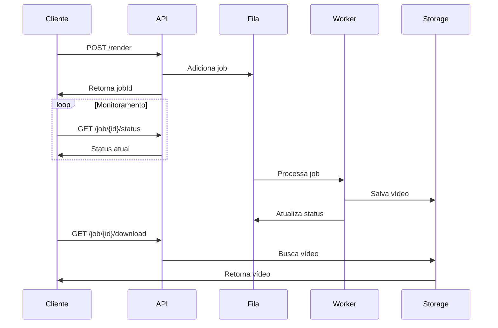

# Processamento Assíncrono

A FFmpeg API utiliza um sistema de **jobs assíncronos** para processar vídeos em background, permitindo que você envie múltiplas requisições sem bloquear a aplicação.

## Como Funciona



## Ciclo de Vida do Job

### 1. Criação

```bash
curl -X POST "http://localhost:3000/api/media/render" \
  -H "Content-Type: application/json" \
  -d '{ "timeline": { ... } }'
```

**Resposta:**
```json
{
  "jobId": "123e4567-e89b-12d3-a456-426614174000",
  "status": "queued",
  "message": "Job criado com sucesso",
  "estimatedTime": "~30 segundos",
  "queuePosition": 2
}
```

### 2. Estados do Job

<Tabs>
  <Tab title="⏳ Queued">
    ```json
    {
      "id": "123e4567-e89b-12d3-a456-426614174000",
      "status": "queued",
      "progress": 0,
      "queuePosition": 3,
      "estimatedTime": "~45 segundos",
      "createdAt": "2024-01-15T10:30:00.000Z"
    }
    ```
    
    - Job está na fila aguardando processamento
    - `queuePosition`: Posição na fila
    - `estimatedTime`: Tempo estimado baseado na fila
  </Tab>
  
  <Tab title="⚙️ Processing">
    ```json
    {
      "id": "123e4567-e89b-12d3-a456-426614174000",
      "status": "processing",
      "progress": 45,
      "currentStep": "Renderizando vídeo",
      "startedAt": "2024-01-15T10:30:15.000Z",
      "estimatedCompletion": "2024-01-15T10:31:00.000Z"
    }
    ```
    
    - Job está sendo processado
    - `progress`: 0-100 (porcentagem)
    - `currentStep`: Etapa atual do processamento
  </Tab>
  
  <Tab title="✅ Completed">
    ```json
    {
      "id": "123e4567-e89b-12d3-a456-426614174000",
      "status": "completed",
      "progress": 100,
      "createdAt": "2024-01-15T10:30:00.000Z",
      "startedAt": "2024-01-15T10:30:15.000Z",
      "completedAt": "2024-01-15T10:30:45.000Z",
      "output": {
        "url": "https://storage.googleapis.com/.../video.mp4",
        "duration": 23.901,
        "size": 2048576,
        "format": "mp4",
        "resolution": "1920x1080"
      }
    }
    ```
    
    - Job concluído com sucesso
    - `output`: Informações do vídeo gerado
    - URL para download disponível
  </Tab>
  
  <Tab title="❌ Failed">
    ```json
    {
      "id": "123e4567-e89b-12d3-a456-426614174000",
      "status": "failed",
      "progress": 30,
      "error": {
        "code": "FFMPEG_ERROR",
        "message": "Erro ao processar vídeo",
        "details": "Invalid codec parameters",
        "step": "Video encoding"
      },
      "createdAt": "2024-01-15T10:30:00.000Z",
      "failedAt": "2024-01-15T10:30:25.000Z"
    }
    ```
    
    - Job falhou durante o processamento
    - `error`: Detalhes do erro ocorrido
    - Informações para debugging
  </Tab>
</Tabs>

### 3. Monitoramento

<CodeGroup>
```bash cURL
# Verificar status
curl -X GET "http://localhost:3000/api/media/job/123e4567-e89b-12d3-a456-426614174000/status"

# Download do resultado
curl -X GET "http://localhost:3000/api/media/job/123e4567-e89b-12d3-a456-426614174000/download" \
  -o "video.mp4"
```

```javascript JavaScript
async function monitorarJob(jobId) {
  while (true) {
    const response = await fetch(`/api/media/job/${jobId}/status`);
    const status = await response.json();
    
    console.log(`Status: ${status.status} (${status.progress}%)`);
    
    if (status.status === 'completed') {
      console.log('✅ Vídeo pronto!', status.output.url);
      break;
    }
    
    if (status.status === 'failed') {
      console.error('❌ Erro:', status.error.message);
      break;
    }
    
    // Aguarda 2 segundos antes de verificar novamente
    await new Promise(resolve => setTimeout(resolve, 2000));
  }
}
```

```python Python
import requests
import time

def monitorar_job(job_id):
    while True:
        response = requests.get(f"/api/media/job/{job_id}/status")
        status = response.json()
        
        print(f"Status: {status['status']} ({status['progress']}%)")
        
        if status['status'] == 'completed':
            print("✅ Vídeo pronto!", status['output']['url'])
            return status['output']['url']
        
        if status['status'] == 'failed':
            print("❌ Erro:", status['error']['message'])
            return None
        
        time.sleep(2)
```
</CodeGroup>

## Sistema de Filas

### Prioridades

```json
{
  "timeline": { ... },
  "priority": "high",  // "low", "normal", "high", "urgent"
  "metadata": {
    "userId": "user123",
    "projectId": "proj456"
  }
}
```

### Limites e Quotas

<CardGroup cols={2}>
  <Card title="👤 Por Usuário" icon="user">
    - **Jobs simultâneos**: 3
    - **Jobs por hora**: 50
    - **Jobs por dia**: 500
    - **Tamanho máximo**: 100MB
  </Card>
  <Card title="🏢 Por Projeto" icon="building">
    - **Jobs simultâneos**: 10
    - **Jobs por hora**: 200
    - **Jobs por dia**: 2000
    - **Armazenamento**: 10GB
  </Card>
</CardGroup>

### Estados da Fila

```bash
curl -X GET "http://localhost:3000/api/admin/queue/status"
```

```json
{
  "queue": {
    "waiting": 12,
    "processing": 3,
    "completed": 145,
    "failed": 2
  },
  "workers": {
    "total": 5,
    "active": 3,
    "idle": 2
  },
  "estimatedWaitTime": "~2 minutos"
}
```

## Webhooks e Notificações

### Configuração de Webhook

```json
{
  "timeline": { ... },
  "webhook": {
    "url": "https://meusite.com/webhook/ffmpeg",
    "events": ["completed", "failed"],
    "secret": "meu-secret-key",
    "retries": 3
  }
}
```

### Payload do Webhook

<Tabs>
  <Tab title="✅ Job Completed">
    ```json
    {
      "event": "job.completed",
      "timestamp": "2024-01-15T10:30:45.000Z",
      "job": {
        "id": "123e4567-e89b-12d3-a456-426614174000",
        "status": "completed",
        "duration": 30.5,
        "output": {
          "url": "https://storage.googleapis.com/.../video.mp4",
          "size": 2048576,
          "format": "mp4"
        }
      },
      "metadata": {
        "userId": "user123",
        "projectId": "proj456"
      }
    }
    ```
  </Tab>
  
  <Tab title="❌ Job Failed">
    ```json
    {
      "event": "job.failed",
      "timestamp": "2024-01-15T10:30:25.000Z",
      "job": {
        "id": "123e4567-e89b-12d3-a456-426614174000",
        "status": "failed",
        "error": {
          "code": "FFMPEG_ERROR",
          "message": "Erro ao processar vídeo",
          "details": "Invalid codec parameters"
        }
      },
      "metadata": {
        "userId": "user123",
        "projectId": "proj456"
      }
    }
    ```
  </Tab>
  
  <Tab title="⚙️ Progress Update">
    ```json
    {
      "event": "job.progress",
      "timestamp": "2024-01-15T10:30:30.000Z",
      "job": {
        "id": "123e4567-e89b-12d3-a456-426614174000",
        "status": "processing",
        "progress": 50,
        "currentStep": "Applying video filters"
      }
    }
    ```
  </Tab>
</Tabs>

### Verificação de Webhook

```javascript
// Verificar assinatura do webhook
const crypto = require('crypto');

function verificarWebhook(payload, signature, secret) {
  const expectedSignature = crypto
    .createHmac('sha256', secret)
    .update(payload)
    .digest('hex');
  
  return signature === `sha256=${expectedSignature}`;
}
```

## Timeouts e Limites

### Configurações de Timeout

```json
{
  "timeline": { ... },
  "options": {
    "timeout": 300,        // 5 minutos (máximo: 600s)
    "priority": "normal",
    "retries": 2,
    "maxDuration": 120     // Vídeo máximo de 2 minutos
  }
}
```

### Limites por Complexidade

| Tipo de Vídeo | Timeout Padrão | Timeout Máximo |
|----------------|----------------|----------------|
| Simples (1 track) | 60s | 300s |
| Médio (2-3 tracks) | 120s | 600s |
| Complexo (4+ tracks) | 300s | 900s |
| 4K/Alta resolução | 600s | 1800s |

## Tratamento de Erros

### Códigos de Erro Comuns

<AccordionGroup>
  <Accordion title="INVALID_TIMELINE" icon="exclamation-triangle">
    **Causa**: Estrutura da timeline inválida
    
    ```json
    {
      "error": {
        "code": "INVALID_TIMELINE",
        "message": "Timeline structure is invalid",
        "details": "Missing required field: tracks",
        "field": "timeline.tracks"
      }
    }
    ```
    
    **Solução**: Verificar estrutura da timeline
  </Accordion>
  
  <Accordion title="ASSET_NOT_FOUND" icon="file-x">
    **Causa**: Asset não pode ser carregado
    
    ```json
    {
      "error": {
        "code": "ASSET_NOT_FOUND",
        "message": "Asset could not be loaded",
        "details": "HTTP 404: File not found",
        "asset": "https://exemplo.com/video.mp4"
      }
    }
    ```
    
    **Solução**: Verificar URL e permissões do asset
  </Accordion>
  
  <Accordion title="FFMPEG_ERROR" icon="cog">
    **Causa**: Erro durante processamento FFmpeg
    
    ```json
    {
      "error": {
        "code": "FFMPEG_ERROR", 
        "message": "FFmpeg processing failed",
        "details": "Invalid codec parameters for h264",
        "step": "Video encoding",
        "ffmpegOutput": "..."
      }
    }
    ```
    
    **Solução**: Verificar configurações de codec e formato
  </Accordion>
  
  <Accordion title="TIMEOUT" icon="clock">
    **Causa**: Job excedeu tempo limite
    
    ```json
    {
      "error": {
        "code": "TIMEOUT",
        "message": "Job exceeded maximum processing time",
        "details": "Processing took longer than 300 seconds",
        "timeout": 300
      }
    }
    ```
    
    **Solução**: Simplificar timeline ou aumentar timeout
  </Accordion>
</AccordionGroup>

### Estratégias de Retry

```javascript
async function processarComRetry(timeline, maxRetries = 3) {
  for (let attempt = 1; attempt <= maxRetries; attempt++) {
    try {
      const response = await fetch('/api/media/render', {
        method: 'POST',
        headers: { 'Content-Type': 'application/json' },
        body: JSON.stringify({ timeline })
      });
      
      if (response.ok) {
        return await response.json();
      }
      
      // Se é o último retry, lança o erro
      if (attempt === maxRetries) {
        throw new Error(`Failed after ${maxRetries} attempts`);
      }
      
      // Aguarda antes do próximo retry (backoff exponencial)
      await new Promise(resolve => 
        setTimeout(resolve, Math.pow(2, attempt) * 1000)
      );
      
    } catch (error) {
      console.log(`Attempt ${attempt} failed:`, error.message);
      
      if (attempt === maxRetries) {
        throw error;
      }
    }
  }
}
```

## Monitoramento e Métricas

### Métricas Disponíveis

```bash
curl -X GET "http://localhost:3000/api/admin/metrics"
```

```json
{
  "jobs": {
    "total": 1250,
    "completed": 1180,
    "failed": 45,
    "processing": 3,
    "queued": 22,
    "successRate": 94.4
  },
  "performance": {
    "averageProcessingTime": 45.2,
    "queueWaitTime": 12.8,
    "throughput": "2.3 jobs/minute"
  },
  "resources": {
    "cpuUsage": 65.2,
    "memoryUsage": 78.5,
    "diskUsage": 45.1
  }
}
```

### Logs Detalhados

```bash
curl -X GET "http://localhost:3000/api/admin/jobs/123e4567-e89b-12d3-a456-426614174000/logs"
```

## Melhores Práticas

<CardGroup cols={2}>
  <Card title="⏱️ Monitoramento" icon="clock">
    - Implemente polling inteligente
    - Use webhooks para notificações
    - Monitore métricas de performance
  </Card>
  <Card title="🔄 Retry Logic" icon="repeat">
    - Implemente retry com backoff
    - Trate erros específicos
    - Defina limites de retry
  </Card>
  <Card title="🎯 Otimização" icon="target">
    - Use prioridades adequadas
    - Otimize timelines complexas
    - Monitore uso de recursos
  </Card>
  <Card title="📊 Análise" icon="chart-bar">
    - Analise logs de erro
    - Monitore taxa de sucesso
    - Otimize baseado em métricas
  </Card>
</CardGroup>

<Warning>
  **Atenção**: Jobs que ficam em processamento por mais de 15 minutos são automaticamente cancelados para liberar recursos.
</Warning>

<Tip>
  **Dica**: Use webhooks para notificações em tempo real em vez de polling constante para economizar recursos.
</Tip> 