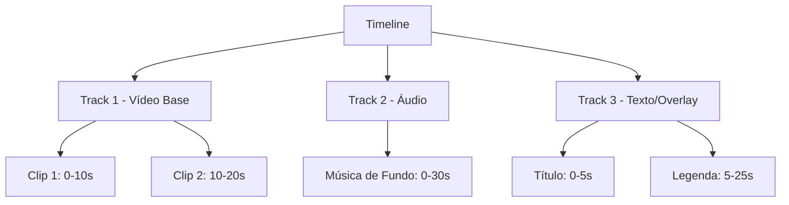

# Timeline e Tracks

A **Timeline** é o conceito central da FFmpeg API. Ela define a estrutura temporal do seu vídeo através de **tracks** (trilhas) que funcionam como camadas sobrepostas.

## Como Funciona



## Estrutura Básica

<CodeGroup>
```json Estrutura Mínima
{
  "timeline": {
    "tracks": [
      {
        "clips": [
          {
            "asset": { /* definição do asset */ },
            "start": 0,
            "length": 10
          }
        ]
      }
    ]
  }
}
```

```json Estrutura Completa
{
  "timeline": {
    "tracks": [
      {
        "type": "video",
        "clips": [
          {
            "asset": {
              "type": "video",
              "source": "url",
              "src": "https://exemplo.com/video.mp4"
            },
            "start": 0,
            "length": "auto",
            "effects": ["fadeIn", "fadeOut"]
          }
        ]
      },
      {
        "type": "audio", 
        "clips": [
          {
            "asset": {
              "type": "audio",
              "source": "url",
              "src": "https://exemplo.com/audio.mp3",
              "volume": 0.8,
              "isBackground": true
            },
            "start": 0,
            "length": "auto"
          }
        ]
      }
    ]
  }
}
```
</CodeGroup>

## Tipos de Tracks

### 🎬 Video Track
Contém clips de vídeo, imagens e elementos visuais.

```json
{
  "type": "video",
  "clips": [
    {
      "asset": {
        "type": "video",
        "source": "url",
        "src": "https://exemplo.com/video.mp4"
      },
      "start": 0,
      "length": 10
    }
  ]
}
```

### 🎵 Audio Track  
Contém áudio de fundo, narração ou efeitos sonoros.

```json
{
  "type": "audio",
  "clips": [
    {
      "asset": {
        "type": "audio",
        "source": "url", 
        "src": "https://exemplo.com/musica.mp3",
        "volume": 0.7,
        "isBackground": true
      },
      "start": 0,
      "length": "auto"
    }
  ]
}
```

### 📝 Text/Overlay Track
Contém textos, legendas e overlays visuais.

```json
{
  "type": "overlay",
  "clips": [
    {
      "asset": {
        "type": "text",
        "text": "Título do Vídeo",
        "style": {
          "fontSize": 48,
          "fontColor": "white",
          "alignment": "center"
        }
      },
      "start": 0,
      "length": 5
    }
  ]
}
```

## Ordenação e Prioridade

As tracks são processadas em **ordem de aparição**:

1. **Primeira track** = Camada de fundo
2. **Segunda track** = Sobreposta à primeira  
3. **Terceira track** = Sobreposta às anteriores

<Warning>
  **Importante**: A ordem das tracks no array define a ordem de renderização. A primeira track sempre fica no fundo.
</Warning>

## Timing e Sincronização

### Start Time
Define quando o clip começa na timeline (em segundos):

```json
{
  "start": 5.5,  // Inicia aos 5.5 segundos
  "length": 10   // Dura 10 segundos (até 15.5s)
}
```

### Length (Duração)
Pode ser definida de duas formas:

<Tabs>
  <Tab title="Duração Fixa">
    ```json
    {
      "start": 0,
      "length": 10.5  // Exatamente 10.5 segundos
    }
    ```
  </Tab>
  
  <Tab title="Duração Automática">
    ```json
    {
      "start": 0,
      "length": "auto"  // Usa toda a duração disponível do asset
    }
    ```
  </Tab>
</Tabs>

### Sobreposição de Clips
Clips podem se sobrepor temporalmente:

```json
{
  "tracks": [
    {
      "clips": [
        { "start": 0, "length": 10 },   // 0-10s
        { "start": 8, "length": 5 }     // 8-13s (sobrepõe 2s)
      ]
    }
  ]
}
```

## Exemplos Práticos

<AccordionGroup>
  <Accordion title="🎬 Vídeo Simples" icon="video">
    Um vídeo com música de fundo:
    
    ```json
    {
      "timeline": {
        "tracks": [
          {
            "clips": [
              {
                "asset": {
                  "type": "video",
                  "source": "url",
                  "src": "https://exemplo.com/video.mp4"
                },
                "start": 0,
                "length": "auto"
              }
            ]
          },
          {
            "clips": [
              {
                "asset": {
                  "type": "audio",
                  "source": "url",
                  "src": "https://exemplo.com/musica.mp3",
                  "volume": 0.3,
                  "isBackground": true
                },
                "start": 0,
                "length": "auto"
              }
            ]
          }
        ]
      }
    }
    ```
  </Accordion>
  
  <Accordion title="📱 Story para Instagram" icon="mobile">
    Vídeo vertical com texto animado:
    
    ```json
    {
      "timeline": {
        "tracks": [
          {
            "clips": [
              {
                "asset": {
                  "type": "image",
                  "source": "url",
                  "src": "https://exemplo.com/background.jpg"
                },
                "start": 0,
                "length": 15
              }
            ]
          },
          {
            "clips": [
              {
                "asset": {
                  "type": "text",
                  "text": "Título Principal",
                  "style": {
                    "fontSize": 64,
                    "fontColor": "white",
                    "bold": true,
                    "alignment": "center"
                  }
                },
                "start": 1,
                "length": 3
              },
              {
                "asset": {
                  "type": "text", 
                  "text": "Subtítulo explicativo",
                  "style": {
                    "fontSize": 32,
                    "fontColor": "#cccccc",
                    "alignment": "center"
                  }
                },
                "start": 4,
                "length": 8
              }
            ]
          }
        ]
      }
    }
    ```
  </Accordion>
  
  <Accordion title="🎓 Apresentação Educativa" icon="graduation-cap">
    Múltiplos slides com narração:
    
    ```json
    {
      "timeline": {
        "tracks": [
          {
            "clips": [
              {
                "asset": {
                  "type": "image",
                  "source": "url",
                  "src": "https://exemplo.com/slide1.png"
                },
                "start": 0,
                "length": 10
              },
              {
                "asset": {
                  "type": "image",
                  "source": "url", 
                  "src": "https://exemplo.com/slide2.png"
                },
                "start": 10,
                "length": 10
              }
            ]
          },
          {
            "clips": [
              {
                "asset": {
                  "type": "audio",
                  "source": "url",
                  "src": "https://exemplo.com/narracao.mp3"
                },
                "start": 0,
                "length": "auto"
              }
            ]
          }
        ]
      }
    }
    ```
  </Accordion>
</AccordionGroup>

## Melhores Práticas

<CardGroup cols={2}>
  <Card title="⏱️ Timing Preciso" icon="clock">
    Use decimais para timing preciso: `"start": 2.5`
  </Card>
  <Card title="🎯 Organização" icon="target">
    Agrupe assets similares na mesma track
  </Card>
  <Card title="🔄 Reutilização" icon="recycle">
    Reutilize assets em múltiplos clips
  </Card>
  <Card title="📐 Planejamento" icon="ruler">
    Planeje a duração total antes de começar
  </Card>
</CardGroup>

<Tip>
  **Dica Pro**: Use `"length": "auto"` para áudio de fundo e defina durações específicas para elementos visuais.
</Tip> 