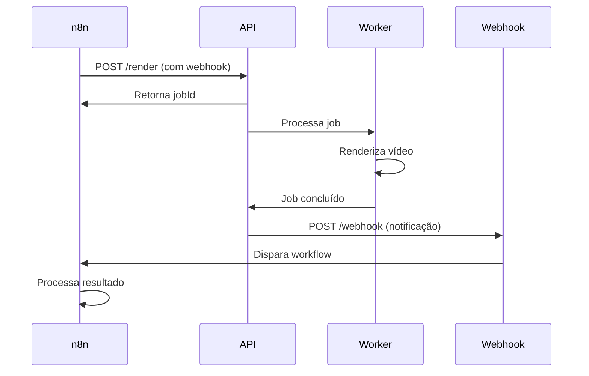
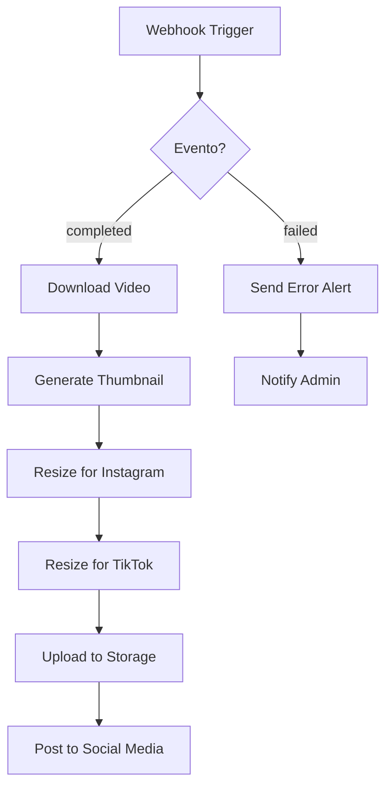
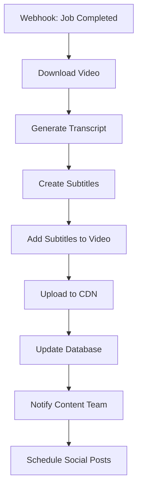
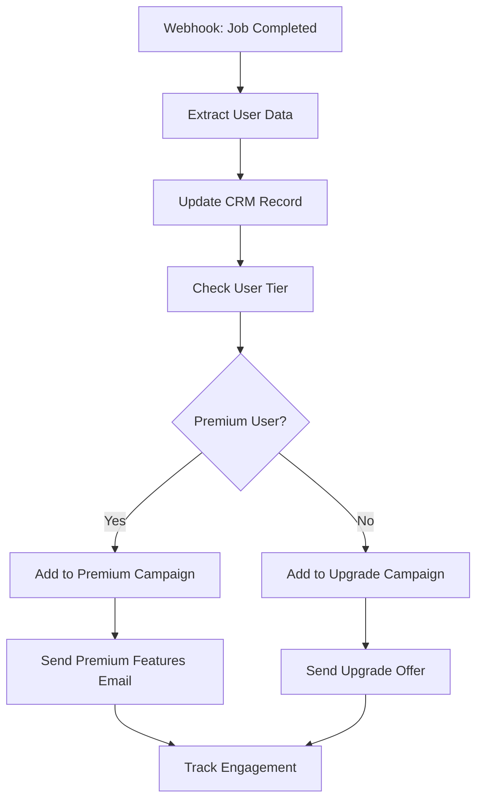

# Webhooks para n8n

Os webhooks permitem integrar a FFmpeg API com n8n para criar automações poderosas de processamento de vídeo. Receba notificações automáticas quando jobs são concluídos e dispare workflows complexos.

## Como Funcionam



## Configuração Básica no n8n

### 1. Configurar Webhook Node

1. **Adicione um Webhook Node** no seu workflow
2. **Configure o HTTP Method** como `POST`
3. **Defina o Webhook Path** (ex: `/ffmpeg-webhook`)
4. **Copie a Webhook URL** gerada

### 2. Incluir Webhook no Request

```json
{
  "timeline": {
    "tracks": [
      {
        "clips": [
          {
            "asset": {
              "type": "video",
              "source": "url",
              "src": "https://exemplo.com/video.mp4"
            },
            "start": 0,
            "length": "auto"
          }
        ]
      }
    ]
  },
  "output": {
    "format": "mp4",
    "resolution": "1280x720",
    "quality": "medium"
  },
  "webhook": "https://sua-instancia.n8n.cloud/webhook/ffmpeg-webhook"
}
```

## Exemplos de Automação n8n

### 1. Processamento de Vídeo para Redes Sociais

**Workflow**: Vídeo processado → Gerar variações → Publicar automaticamente



**Configuração n8n**:

1. **Webhook Node**: Recebe notificação da API
2. **Switch Node**: Filtra por `event = "job.completed"`
3. **HTTP Request Node**: Baixa o vídeo processado
4. **Code Node**: Processa metadados do vídeo
5. **Multiple HTTP Nodes**: Gera variações (Instagram, TikTok, YouTube)
6. **Social Media Nodes**: Publica automaticamente

### 2. Pipeline de Conteúdo Automatizado

**Workflow**: Vídeo pronto → Transcrição → Legendas → Distribuição



**Nodes n8n**:

1. **Webhook**: Recebe `job.completed`
2. **HTTP Request**: Baixa vídeo da API
3. **OpenAI Node**: Gera transcrição do áudio
4. **Code Node**: Formata legendas SRT
5. **HTTP Request**: Envia para API com legendas
6. **AWS S3 Node**: Upload para CDN
7. **MySQL Node**: Atualiza banco de dados
8. **Slack Node**: Notifica equipe
9. **Schedule Trigger**: Agenda posts futuros

### 3. Sistema de Notificações Inteligentes

**Workflow**: Status do job → Análise → Notificação personalizada

```json
// Dados recebidos no webhook
{
  "event": "job.completed",
  "job": {
    "id": "123e4567-e89b-12d3-a456-426614174000",
    "status": "completed",
    "output": {
      "url": "https://storage.googleapis.com/.../video.mp4",
      "duration": 23.901,
      "size": 2048576,
      "format": "mp4",
      "resolution": "1920x1080"
    },
    "metadata": {
      "userId": "user123",
      "projectName": "Meu Projeto",
      "tags": ["marketing", "produto"]
    }
  }
}
```

**Configuração n8n**:

```javascript
// Code Node - Processar dados do webhook
const { event, job } = $input.all()[0].json;

if (event === 'job.completed') {
  const { output, metadata } = job;
  
  // Determinar tipo de notificação baseado em tags
  let notificationType = 'default';
  let channels = ['email'];
  
  if (metadata.tags.includes('urgent')) {
    notificationType = 'urgent';
    channels = ['email', 'slack', 'sms'];
  } else if (metadata.tags.includes('marketing')) {
    notificationType = 'marketing';
    channels = ['email', 'slack'];
  }
  
  return {
    json: {
      userId: metadata.userId,
      projectName: metadata.projectName,
      videoUrl: output.url,
      duration: output.duration,
      size: Math.round(output.size / 1024 / 1024), // MB
      notificationType,
      channels,
      message: `✅ Vídeo "${metadata.projectName}" processado com sucesso!`
    }
  };
}
```

### 4. Integração com CRM/Database

**Workflow**: Vídeo processado → Atualizar CRM → Disparar campanhas



**Configuração n8n**:

1. **Webhook Node**: Recebe dados do job
2. **Code Node**: Extrai informações do usuário
3. **HubSpot/Salesforce Node**: Atualiza registro do cliente
4. **MySQL Node**: Consulta tier do usuário
5. **IF Node**: Verifica se é usuário premium
6. **Email Nodes**: Envia campanhas personalizadas
7. **Google Analytics Node**: Rastreia engajamento


## Eventos Disponíveis

### job.started
```json
{
  "event": "job.started",
  "job": {
    "id": "123e4567-e89b-12d3-a456-426614174000",
    "status": "processing",
    "startedAt": "2024-01-15T10:30:15.000Z",
    "estimatedCompletion": "2024-01-15T10:31:00.000Z"
  }
}
```

### job.completed
```json
{
  "event": "job.completed",
  "job": {
    "id": "123e4567-e89b-12d3-a456-426614174000",
    "status": "completed",
    "output": {
      "url": "https://storage.googleapis.com/.../video.mp4",
      "duration": 23.901,
      "size": 2048576,
      "downloadUrl": "http://localhost:3000/api/media/job/123e4567-e89b-12d3-a456-426614174000/download"
    },
    "metadata": {
      "userId": "user123",
      "projectName": "Meu Projeto"
    }
  }
}
```

### job.failed
```json
{
  "event": "job.failed",
  "job": {
    "id": "123e4567-e89b-12d3-a456-426614174000",
    "status": "failed",
    "error": {
      "code": "FFMPEG_ERROR",
      "message": "Erro ao processar vídeo",
      "details": "Invalid codec parameters"
    }
  }
}
```

## Boas Práticas para n8n

### ✅ Recomendações

1. **Use Switch Nodes** para filtrar eventos específicos
2. **Implemente Error Handling** com Try/Catch nodes
3. **Armazene dados importantes** em variáveis globais
4. **Use Queue Nodes** para processamento em lote
5. **Monitore execuções** com logs estruturados

### ❌ Evite

1. **Não processe todos os eventos** desnecessariamente
2. **Não ignore tratamento de erros** em workflows críticos
3. **Não faça loops infinitos** sem condições de parada
4. **Não exponha dados sensíveis** em logs

### Exemplo de Workflow Robusto

```javascript
// Code Node - Handler principal
try {
  const { event, job, timestamp } = $input.all()[0].json;
  
  // Log estruturado
  console.log(`📢 n8n Webhook: ${event} para job ${job.id}`);
  
  // Validar dados essenciais
  if (!job || !job.id) {
    throw new Error('Dados do job inválidos');
  }
  
  // Processar baseado no evento
  switch (event) {
    case 'job.completed':
      return {
        json: {
          action: 'process_completed',
          jobId: job.id,
          videoUrl: job.output.url,
          metadata: job.metadata,
          timestamp: new Date().toISOString()
        }
      };
      
    case 'job.failed':
      return {
        json: {
          action: 'handle_error',
          jobId: job.id,
          error: job.error,
          timestamp: new Date().toISOString()
        }
      };
      
    default:
      return {
        json: {
          action: 'log_event',
          event,
          jobId: job.id,
          timestamp: new Date().toISOString()
        }
      };
  }
  
} catch (error) {
  console.error('❌ Erro no webhook n8n:', error);
  
  // Retornar erro estruturado
  return {
    json: {
      action: 'error',
      error: error.message,
      timestamp: new Date().toISOString()
    }
  };
}
```

## Monitoramento no n8n

### Logs Estruturados

```javascript
// Code Node - Sistema de logs
const logLevel = 'INFO'; // DEBUG, INFO, WARN, ERROR
const logData = {
  level: logLevel,
  timestamp: new Date().toISOString(),
  workflow: $workflow.name,
  execution: $execution.id,
  event: $input.all()[0].json.event,
  jobId: $input.all()[0].json.job.id,
  message: 'Webhook processado com sucesso'
};

console.log(JSON.stringify(logData));

// Salvar em banco para análise
return {
  json: {
    ...logData,
    shouldSaveToDatabase: true
  }
};
```

### Métricas e Alertas

```javascript
// Code Node - Métricas de performance
const startTime = new Date($execution.startedAt);
const currentTime = new Date();
const executionTime = currentTime - startTime;

const metrics = {
  executionTime,
  event: $input.all()[0].json.event,
  success: true,
  timestamp: currentTime.toISOString()
};

// Alertar se execução demorou muito
if (executionTime > 30000) { // 30 segundos
  return {
    json: {
      ...metrics,
      alert: true,
      message: `⚠️ Execução lenta detectada: ${executionTime}ms`
    }
  };
}

return { json: metrics };
```

<Warning>
  **Importante**: Configure timeouts adequados nos seus workflows n8n para evitar execuções que ficam travadas.
</Warning>

<Tip>
  **Dica**: Use o n8n cloud para webhooks públicos ou configure adequadamente o n8n self-hosted com HTTPS para produção.
</Tip> 