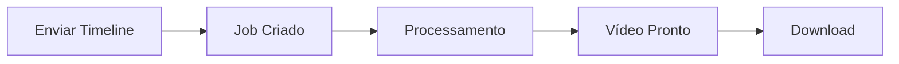

# FFmpeg API

Uma API moderna e escalável para processamento de vídeo usando FFmpeg, construída com Node.js e TypeScript.

<CardGroup cols={2}>
  <Card
    title="🚀 Alta Performance"
    icon="rocket"
    href="/quickstart"
  >
    Processamento otimizado com suporte a hardware acceleration
  </Card>
  <Card
    title="🎬 Múltiplos Formatos"
    icon="video"
    href="/concepts/output-formats"
  >
    Suporte a MP4, GIF, MOV, WebM e HLS
  </Card>
  <Card
    title="🎵 Áudio Avançado"
    icon="music"
    href="/guides/audio-mixing"
  >
    Mixagem automática com áudio de fundo
  </Card>
  <Card
    title="📱 Pronto para Produção"
    icon="cloud"
    href="/examples/lyric-video"
  >
    Google Cloud Storage e monitoramento integrado
  </Card>
</CardGroup>

## Como Funciona

A FFmpeg API permite criar vídeos complexos através de uma interface REST simples. Você envia uma **timeline** com **clips** e **assets**, e recebe um vídeo processado.

### Fluxo Básico

<Steps>
  <Step title="Criar Timeline">
    Defina a estrutura do seu vídeo com clips, áudio e texto
  </Step>
  <Step title="Enviar Requisição">
    Faça uma requisição POST para `/api/media/render`
  </Step>
  <Step title="Acompanhar Progresso">
    Use o endpoint `/api/media/job/{id}/status` para monitorar
  </Step>
  <Step title="Baixar Resultado">
    Acesse o vídeo final através do endpoint de download
  </Step>
</Steps>

## Casos de Uso

<AccordionGroup>
  <Accordion title="🎵 Lyric Videos" icon="music">
    Crie vídeos com letras sincronizadas automaticamente
    
    - Texto animado frame por frame
    - Sincronização com áudio
    - Backgrounds personalizados
  </Accordion>
  
  <Accordion title="📱 Conteúdo para Redes Sociais" icon="mobile">
    Gere posts automáticos para Instagram, TikTok e YouTube
    
    - Formatos otimizados (9:16, 16:9, 1:1)
    - Compilações automáticas
    - Legendas e overlays
  </Accordion>
  
  <Accordion title="🎓 Conteúdo Educacional" icon="graduation-cap">
    Produza aulas e tutoriais automatizados
    
    - Slides sincronizados
    - Narração automática
    - Capturas de tela
  </Accordion>
  
  <Accordion title="🏢 Vídeos Corporativos" icon="building">
    Relatórios visuais e apresentações
    
    - Gráficos animados
    - Dados em tempo real
    - Branding consistente
  </Accordion>
</AccordionGroup>

## Recursos Principais

<CardGroup cols={3}>
  <Card title="Timeline Flexível" icon="timeline">
    Sistema de camadas para vídeo, áudio e texto
  </Card>
  <Card title="Assets Dinâmicos" icon="image">
    Suporte a URLs, uploads e assets locais
  </Card>
  <Card title="Processamento Assíncrono" icon="clock">
    Jobs em background com monitoramento
  </Card>
  <Card title="Múltiplos Formatos" icon="file-video">
    MP4, GIF, MOV, WebM e HLS
  </Card>
  <Card title="Cloud Storage" icon="cloud">
    Integração com Google Cloud Storage
  </Card>
  <Card title="Monitoramento" icon="chart-line">
    Métricas e logs detalhados
  </Card>
</CardGroup>

## Começar Agora

<Card
  title="🚀 Quickstart"
  icon="play"
  href="/quickstart"
>
  Crie seu primeiro vídeo em 5 minutos
</Card>

<Tip>
  **Dica**: Use a [documentação interativa](http://localhost:3000/api-docs) para testar a API diretamente no navegador!
</Tip> 